# Getting started with SvelteKit

Enda Lee 2022

### Quick Start

1. Download the code from this repository
2. Open in VS Code
3. In a terminal run `npm install`
4. Start the application using `npm run dev`

## Introduction

From now on we will be using a front-end framework, **SvelteKit**, to build client web applications.

In this lab you will use **SvelteKit** to build and server a simple website.


## 1. Create a new SvelteKit application

Start by creating a folder for your application and the open it in VS Code, for example:

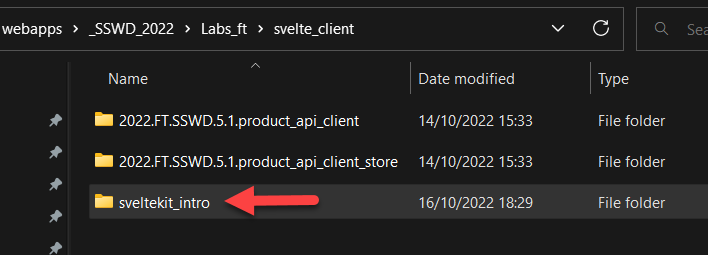


Execute the following command in a VS Code terminal to create the application

```bash
npm create svelte@latest
```

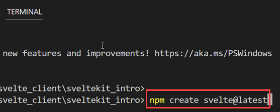


You will be asked a series of question:

1. Choose a directory name: **leave blank and press enter to use the current directory**

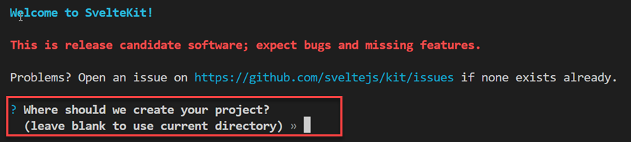

2. New project template: **Use the arrow keys (up/ down) and press enter to choose the Skeleton Project**

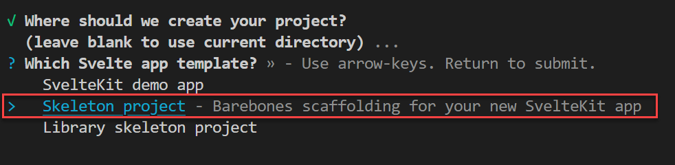

3. Choose language: **Select JavaScript**

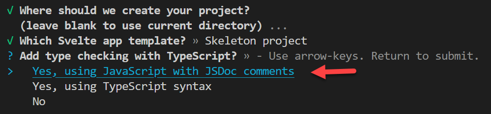

4. Choose whether to use ESlint: **Choose No for this example**

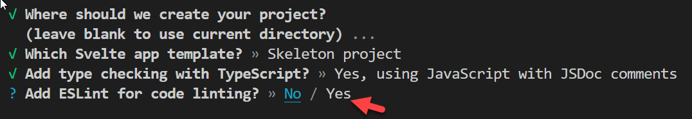

5. Choose whether to use Prettier formatting: **Choose Yes**

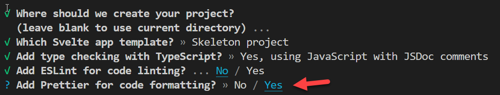

6. Testing options: **Choose No for this example**

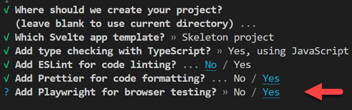

7. The new SvelteKitapp is now created: run **npm install** and **npm run dev** to start it

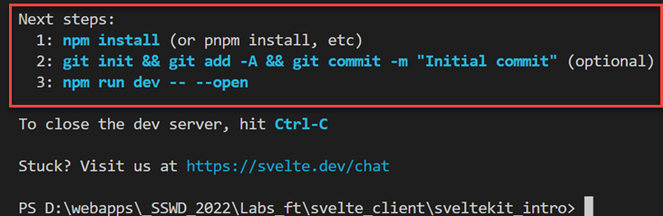

8. Running the app

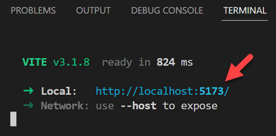

9. Open in a browser using **http://localhost:5173**

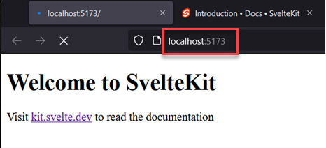


## 2. Examine the App structure

The home page served to the browser was generated from the **```\src\routes```** folder. The file **```routes\+page.svelte```** contains the home page. Note that this file naming scheme is a requirement  of the framework.

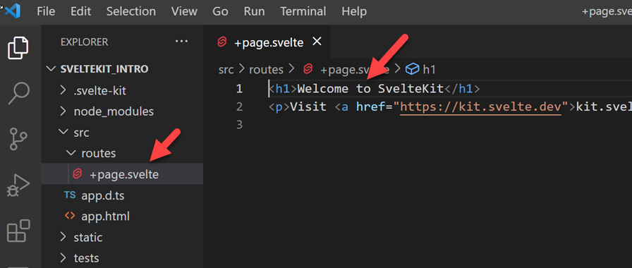


### 2.1. Adding new page routes

 To add an **about** and **contact** page to the site, ad two new folders also named about and contact. Then add a new file to each folder named **+page.svelte** 

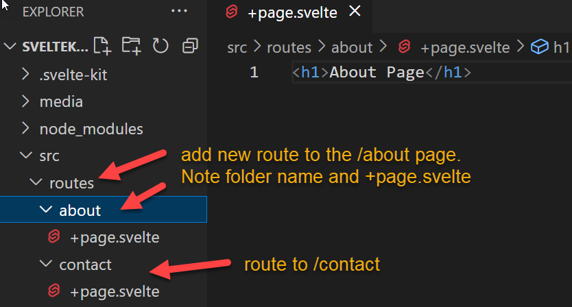


Add a H1 element to both pages to indicate the page content. Note that only html body content is required. The rest of the HTML page is loaded from **```src/app.html```**

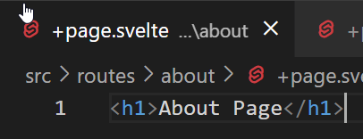

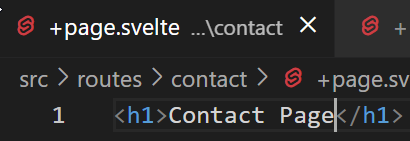


### 2.2. Testing the new routes

Open the new page routs in a browser. You will see that the the page/ route names are derived from the names of the folders added to **```/src/routes/```**

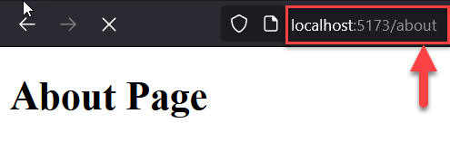

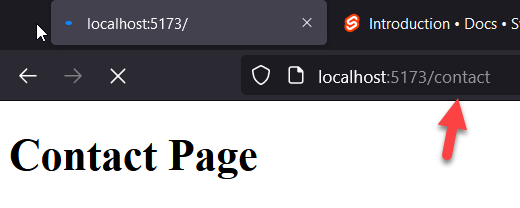


## 3. Adding a navigation menu

A shared layout definition can be used to easily add navigation links to all the pages. Add **```+layout.svelte```** to the **routes** folder:

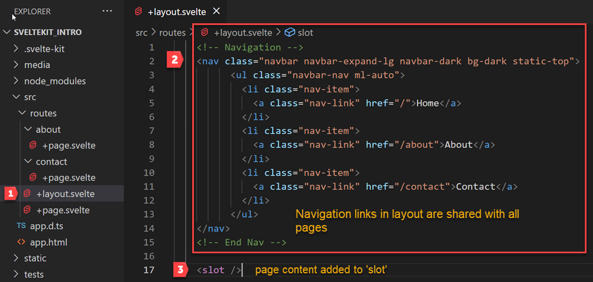

The navigation menu uses Bootstrap 5 for styling. Also note the **```<slot />```** element. This indicates where page content will be added when the page is generated by Sveltekit.


### 3.1. Bootstrap dependencies

These should be added to **```app.html```** so that they are loaded globally.

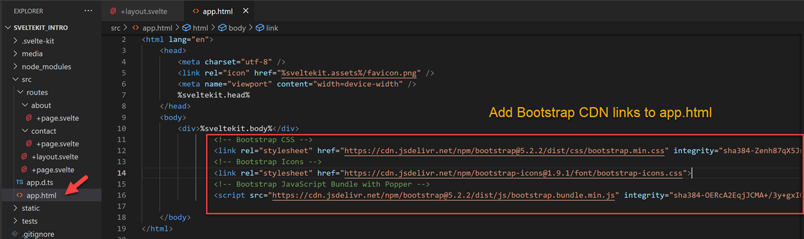


### 3.2 Test the Navigation

Save all open files and reload the app in your browser. You should now have working navigation.

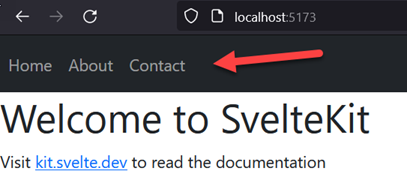


## 4. Component variable example

Each **```.svelte```** page is a self contained component which can include its own script, style, and HTML content. This simple example shows how to define a variable and use it in the page.

 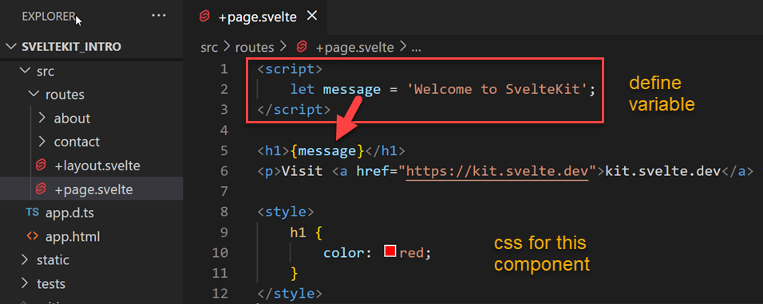


Also notice how the CSS is only applied to the home page and not the others.


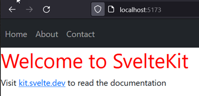


## Conclusion

This was a simple example - we will be using many of the framework features in future labs so you should get familiar with the documentation at https://kit.svelte.dev/docs/introduction#getting-started


